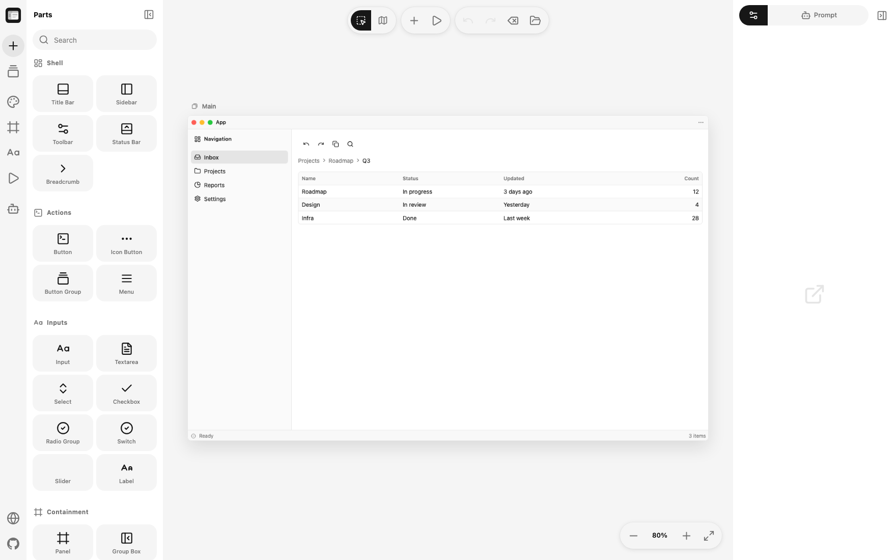

<p align="center">
  
</p>

<h1 align="center">GPUI Kit Canvas</h1>

<p align="center">
  <strong>在浏览器中拼装 <a href="https://github.com/longbridge/gpui-kit">gpui-kit</a> 的桌面窗口，把窗口连起来、点一点试试，然后直接变成给 AI 编程工具的提示词。</strong>
</p>

<p align="center">
  <a href="LICENSE"></a>
  
  
  
  
</p>

<p align="center">
  <a href="README.md">English</a> · <a href="README.ja.md">日本語</a>
</p>



可配合任何接受提示词的 AI 编程工具使用，例如 Claude Code、Codex、Gemini CLI 或 Cursor：复制提示词，粘贴到工具里，让它把应用做出来。

本项目 fork 自 [lnkiai/m3e-canvas](https://github.com/lnkiai/m3e-canvas)，把目标从 Material 3 Expressive 手机界面改为 gpui-kit 桌面窗口。

## 功能

- **拖放组件** – 共 66 个，按取用习惯分组：窗口骨架（标题栏、侧边栏、工具栏、状态栏、面包屑）、操作（按钮、图标按钮、按钮组、菜单）、输入（输入框、多行输入、下拉选择、可搜索下拉框、复选框、单选组、开关、滑块、标签、表单、评分、颜色选择器、日期选择器、日历、设置页）、容器（面板、分组框、标签页、可调分栏、手风琴、折叠区、分页、步骤条、停靠区、滚动条）、浮层（对话框、抽屉面板、浮层、通知、工具提示、悬浮卡片、命令面板）、数据（列表、数据表格、树、图表）、内容（文本、图标、图片、分隔线、徽标、标签块、头像、Kbd、链接、状态标记、复制按钮、微光文本、描述列表）、反馈（提示条、进度条、加载指示器、骨架屏），以及聊天（消息、气泡、附件、消息滚动区）。
- **每个组件都真实存在** – 每个部件都点名一个真实的 `gpui_kit::component` 路径，`npm run check:api` 会从 gpui-kit 仓库把所有路径逐个读回核对，不存在就报错退出。调色板覆盖 gpui-kit 63 个组件模块中的 58 个，余下 5 个（`measure`、`native_menu`、`plot`、`searchable_list`、`window_border`）属于基础设施而非可放置的部件。
- **真实的尺寸** – 组件高度、内边距、圆角和行高均取自 gpui-kit 源码（`sizing.rs`、`title_bar.rs`、`sidebar/mod.rs`）：medium 按钮为 32px，表格行同样是 32px。
- **真实的主题** – 从 gpui-kit 仓库解析出的 33 套配色（内置 Default Light / Dark 加上自带的 21 套主题）。画布上的所有颜色都是 gpui-kit 的语义 token，提示词中会用真实的键名写出（如 `primary.background`、`sidebar.accent.background`）。
- **真实的图标** – 图标选择器只提供 `gpui-kit-assets` 自带的 101 个 Lucide 图标，提示词中写成 `IconName::` 变体，因此草图不会指定生成的应用画不出来的图标。
- **窗口骨架** – 每个窗口从设计规范列出的五种骨架（单一工作区、侧栏工作区、列表与详情、文档标签、工具窗口）中选择，提示词会在描述组件之前先说明骨架。
- **磁吸连接** – 把两个按钮靠近，它们会合并成一个 `ButtonGroup`，相接的一侧圆角变方。
- **多窗口** – 可添加任意多个窗口，并分别设置名称、尺寸（1024×640 至 1680×1050）与背景 token；拖动窗口会带着里面的内容一起移动。
- **点击跳转** – 可为组件、标题栏图标，以及侧边栏、标签页、菜单、列表、面包屑的条目设置目标窗口（或「返回」）。画布上会显示流程箭头，预览中可以真的点击跳转。
- **快捷键** – 为组件设置快捷键后，提示词会要求生成对应的 `actions!` 定义、`bind_keys` 绑定，并在 tooltip 中用 `Kbd` 展示。
- **可编辑的数据** – 数据表格的每一列都有自己的标签和「数值」标记（标记后右对齐，符合可比较数值的排版惯例），行则按单元格编辑。对话框自带确认按钮文案，因此提示词要求的是「删除」而不是「确定」。
- **图层与编组** – 图层面板显示每个窗口的层叠顺序；多选后可编组，保持叠放关系并一起移动。提示词会明确写出叠放和横向排列，让生成的布局不走样。
- **主题** – 只涵盖 gpui-kit `ThemeConfig` 真正具备的轴。配色：33 套自带调色板或手工微调的一整套 token，浅色／深色，以及「跟随系统」开关。圆角：一次设置 `theme.radius` 与 `radius.lg`（方形／标准／圆润）。字体：系统 UI 字体或指定字族。密度：紧凑／标准／宽松，也就是组件的默认 `Size`。此外还有 `theme.shadow` 与 `theme.focus_ring`。
- **提示词输出** – 整个设计（或单个窗口）会变成日文、英文或中文的简洁说明：骨架、主题、布局、行为、所用每个部件对应的准确 `gpui_kit::component`，以及以「先读 gpui-kit 的 skill 或文档，绝不编造 API」开头的收尾指引。
- **整理** – 一键把标题栏贴到顶部、侧边栏贴到前置边、状态栏贴到底部，把工具栏和面包屑排成标题栏下方的横带，对话框居中，通知落到后置角，其余按 16px 面板内边距重新排布。再按一次即可撤销。
- **三种语言** – 界面、文档的初始内容和提示词都提供日文、英文、中文。首次访问按浏览器语言生成，切换语言时初始内容也会跟着走：每个组件都记得自己被创建时的文案，因此仍是内置默认值的会用新语言重新读取，而你自己敲的字原样保留。
- **AI 辅助（可选）** – 填入自己的密钥（OpenAI、Claude、Gemini、DeepSeek、Kimi Code），让模型用界面语言写出组件的行为或窗口的说明。密钥只保存在浏览器中，请求直接发送给服务商，中间没有服务器。
- **导出** – 复制提示词（也可先手动编辑），或把窗口保存为 PNG。
- **对齐辅助线**、撤销／重做、键盘快捷键、组件面板的收藏。所有内容自动保存在浏览器（localStorage）中。

## 它写出的提示词

以下是 Tokyo Night 主题下一个单窗口草图的**真实**输出摘录：

```markdown
请用 gpui-kit（Rust 桌面 UI 框架）实现 Fleet。用于盯着一组构建机的工具。
这是一个桌面应用，默认窗口尺寸为 1280×800。桌面并不意味着固定尺寸，请同时确定
窗口变窄时的行为。只做深色主题。

## 窗口骨架
- 侧栏工作区：左侧导航保持不变，右侧详情视图随之切换。内容变化时导航不要移动。

## 窗口结构
“主窗口”窗口（1280×800）的结构如下（重叠的组件会特别说明）：
- 上部放置标题为“应用”的标题栏（macOS 风格，左侧红黄绿按钮），后置
  IconName::Ellipsis。
- 中部靠前置边放置标题为“导航”的侧边栏（宽 255px），条目为 “收件箱”
  (IconName::Inbox)、“项目” (IconName::Folder) …
- 上部居中放置列为 “名称”、“状态”、“更新时间”、“数量”（数值，右对齐）的
  数据表格（3 行示例：Roadmap / 进行中 / 3 天前 / 12 …），高 129px，超出的行
  滚动显示。
- 下部放置状态栏，左侧为 IconName::CircleCheck 与“就绪”，右侧为“3 项”。

## 行为与视图切换
- “Save”按钮：快捷键为 cmd-s（用 actions! 定义 action，用 bind_keys 绑定，并在
  按钮 tooltip 中用 Kbd 显示）。

## 需要使用的组件
- 数据表格: `table::{DataTable, TableState, TableDelegate}` — 表头、数据行、汇总行、
  加载态和行内编辑要保持同一套列几何。可比较的数值右对齐，文本和标识符左对齐。
```

## 跟随 gpui-kit 更新

配色和图标都从 gpui-kit 仓库生成，因此不会掺入猜测：

```bash
npm run gen:themes -- ../gpui-kit   # lib/kit-themes.gen.ts（33 套配色）
npm run gen:icons  -- ../gpui-kit   # lib/kit-icons.gen.ts（101 个图标）
npm run check:api  -- ../gpui-kit   # 校验所有组件路径，并列出尚未覆盖的模块
```

三者默认都指向 `../gpui-kit`，可用 `GPUI_KIT` 覆盖路径。真正守住底线的是 `check:api`：
它把 `lib/tokens.ts` 里的每个组件路径抽出来，逐个到 Rust 源码中查证，因此某个部件
不可能悄悄声称一个并不存在的 API。`script/gen-kit-themes.mjs` 在解析主题时，会用与
`crates/component/src/theme/schema.rs` 里 `ColorsConfig::apply_config` 完全相同的
回退链来补齐主题未指定的 token——所以哪怕一套主题只写了 `background`，侧边栏、
列表和表格的配色依然协调。

## 快捷键

| 按键 | 动作 |
| --- | --- |
| `V` / `H` | 选择 / 抓手（按住 `Space` 也可平移） |
| 滚轮、`Ctrl` + 滚轮 | 平移、缩放 |
| `+` `-` `0` | 放大、缩小、适应窗口 |
| `Ctrl+Z` / `Ctrl+Shift+Z` | 撤销 / 重做 |
| `Ctrl+D` | 复制 |
| `Ctrl+G` / `Ctrl+Shift+G` | 编组 / 取消编组 |
| 方向键（`Shift` 为 10） | 微调 |
| `Delete` | 删除所选组件，或所选窗口 |
| `Esc` | 清除选择 |
| `P` | 预览 |

## 开发

```bash
npm install
npm run dev        # http://localhost:3000
npm run typecheck  # tsc --noEmit
npm run build      # 静态导出到 ./out
```

这是一个静态 Next.js 导出（`output: "export"`）：没有服务端，`out/` 就是整个站点。
若要部署在子路径下，请在构建时设置 `NEXT_PUBLIC_BASE_PATH=/仓库名`。

## 部署

### Cloudflare Workers

`wrangler.jsonc` 把 `out/` 作为 Workers 静态资源部署——没有适配器，也没有 Worker 脚本：

```bash
npm run build
npm run preview    # wrangler dev，本地提供 ./out
npm run deploy     # wrangler deploy
```

这里**不要**设置 `NEXT_PUBLIC_BASE_PATH`，站点从域名根路径提供。把 `wrangler.jsonc`
提交进仓库很关键：没有它，`wrangler deploy` 会自动识别为「Next.js」并装上 OpenNext
适配器，然后去找静态导出根本不产出的 `.next/standalone` 而失败。

### GitHub Pages

`.github/workflows/deploy.yml` 会以 `NEXT_PUBLIC_BASE_PATH=/<仓库名>` 构建，并在每次
推送到 `main` 时发布 `out/`。

## 致谢

- 组件、尺寸、主题与图标：[longbridge/gpui-kit](https://github.com/longbridge/gpui-kit)（Apache-2.0）
- 图标：[Lucide](https://lucide.dev)（ISC），由 `gpui-kit-assets` 打包提供
- 编辑器本体：fork 自 [lnkiai/m3e-canvas](https://github.com/lnkiai/m3e-canvas)（MIT）

## 许可证

MIT
